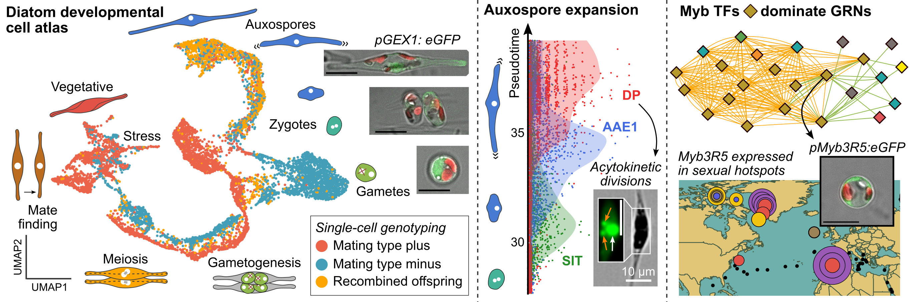

# Diatom life cycle single-cell atlas

> Single-cell transcriptomic data exploration and visualizations for the study "A Myb-dominated gene regulatory network universally controls sexual cell fate transitions in diatoms"

**Note:** This repository represents the analyses downstream of read mapping, quality filtering, clustering and UMAP creation. The preceding pipeline, performed by the VIB single-cell core / PSB single-cell platform, is documented here: https://github.com/vibscc/PlantSingleCellAnalysis/

## Input data

Annotated Seurat Objects used as a starting point for the analyses in this repository can be downloaded from GEO (https://www.ncbi.nlm.nih.gov/geo/query/acc.cgi?acc=GSE303315):
* GSE303315_seuratObj_for_publication.rds # LL experiments (LL 12h, LL 19h, LL 24h)
* GSE303315_seuratObj2_for_publication.rds # LD experiments (LD Light, LD Dark)

ZW2.20 genomic Illumina reads for genotyping can be downloaded from ENA:
* wget -nc ftp://ftp.sra.ebi.ac.uk/vol1/fastq/ERR167/035/ERR16730035/ERR16730035_2.fastq.gz
* wget -nc ftp://ftp.sra.ebi.ac.uk/vol1/fastq/ERR167/035/ERR16730035/ERR16730035_1.fastq.gz

The *Cylindrotheca closterium* genome assembly and annotation version used for this study can be found here: bioinformatics.psb.ugent.be/gdb/Cylindrotheca_closterium/Version1.2 

## Script locations

* The RMarkdown file "scripts/Main_Rmarkdown_diatom_single_cell_atlas.Rmd" has an overview of single-cell transcriptomic data analysis and visualizations. A knitted HTML report with figures and code output is available. 

* Shell scripts used for variant calling (genotyping of single-cells) are stored in "data/variant_calling". These were run on a SLURM cluster system.

* The config file used to run MINI-EX v1 with NextFlow can be found here: "scripts/mini_ex_SLURM_LL_run.config"

## Other data files from these analyses

Tables with marker genes and their functional annotation, gene regulatory network files, as well as details about vector assembly are available on Zenodo with DOI: https://doi.org/10.5281/zenodo.15863610